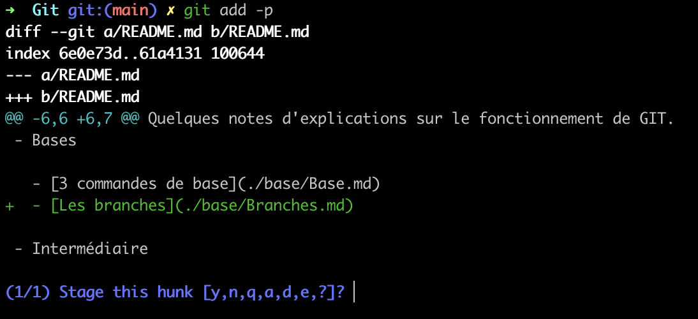
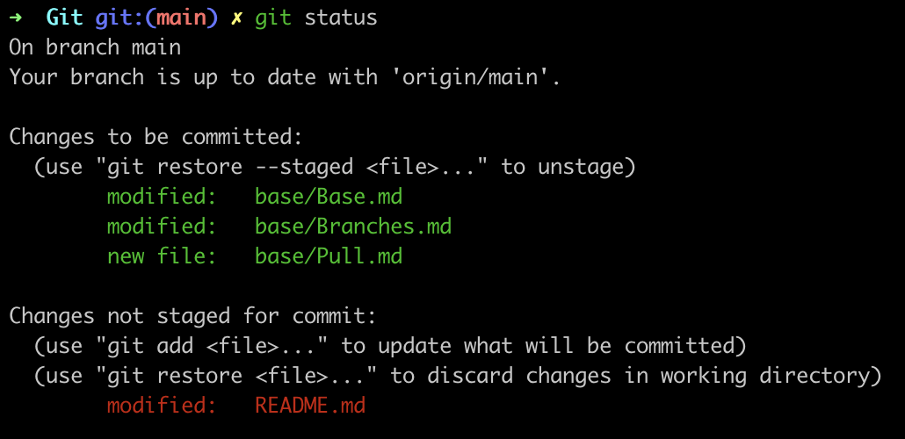

## Git, c'est quoi ?

Git est un outil de versioning permettant de jouer avec le temps dans un projet de développement. 
Il permet également, en combinaison avec d'autres outils tels que gitlab ou github, de publier son code sur des dépôts distants pour les stocker sur des serveurs. 
	
Lorsque l'on travaille sur un projet de développement il est très utile d'utiliser git. Cet outil va nous permettre entre autre de sauvegarder des versions de notre projet, de faire des modifications sans détériorer notre code de base, un peu à l'image d'une base de test nous allons donc pouvoir créer des versions de tests de nos projets, revenir sur des anciennes versions, etc. 
	
Le principe de base est assez simple et se déroule en 3 étapes. 
Après modifications des fichiers la première étape est de valider les modifications (stage) puis nous allons commit ces changements et enfin les push sur le dépôt distant. 
	
## 3 commandes de base
### Stage : 
Commande : ```git add```
Il existe plusieurs options à la commande git add et elle ne seront pas toutes énumérées ici.
Je listerais seulement celle que j'utilise le plus pour le moment. 
	
La comande git add va permettre d'instancier les changements apportés à des fichiers mais aussi de suivre (track) des fichiers qui viennent d'être ajoutés. 
	
Imaginons que je vienne de modifier un ou des fichiers dans mon projet sur une branche. 
Avec un ```git status``` j'aurais alors la liste des fichiers modifiés. 
	
Ceux-ci apparaîtront en rouge pour signaler qu'ils sont unstage. 
Plusieurs solutions s'offrent à moi : 

		git add <file> 
Stage le fichier sélectionné. 
		
		git add <directory>
Stage tout les fichiers dans le dossier
		 
		git add -p
Ouvre une session de stage intéractif et permet de répondre avec des options pour dire si on souhaite stage des parties de fichiers. 


		
Git add -p est vraiment pratique afin de pouvoir choisir précisément quelle partie de fichiers doit être stage ou non et de plus instaure une première relecture de vos changements. 
	
### Commit : 
Commande : ```git commit```
	
Le commit permet en quelque sorte d'encapsuler vos changements afin de potentiellement revenir dessus pour corriger une erreur, pour repartir sur ces modifications, etc. 
	
Une fois vos fichiers stage il faudra donc les commit afin de les "encapsuler". 
De plus il est conseillé de donné un titre ou un commentaire afin de dire de façon succinte les changements apportés. Pour cela on ajoutera l'option -m avec un texte à la suite de cette façon : 
		
    git commit -m "commentaire de modification"
	
Votre travail est maintenant enregistrer en quelque sorte dans une capsule. Mais seulement sur votre ordinateur. 
Pour partager vos changements vous devrez alors pousser (push) votre travaille sur le dépôt distant. 
	
### Push : 
Commande : ```git push```
	
Le push, comme son nom l'indique, permet de pousser votre travail local en distant. 
Pour cela il suffit de faire un git push en se trouvant sur la branche que vous souhaitez push. 
Votre travail est à présent à jour avec votre dépôt distant. 

### Status, une commande bien utile

Il est important de savoir quel est l'état de vos fichiers pour savoir si ceux-ci sont stage ou non. 
Comme évoqué un peu plus haut pour cela on utilise la commande ```git status``` cela va nous permettre de savoir 
si on track ou non nos fichiers et lesquels vont être commit. 



Pourquoi c'est important ? 

Lorsque vous travaillerez en équipe il se peut que la stratégie de votre groupe de travail ou entreprise soit de créer des branches 
pour chaque changements, fix de bugs, etc. Dans ce cas il est fort probable que vous deviez limiter les changements que vous devriez commits. 
Afin d'éviter des situations complexes, il peut être bon de prendre pour habitude de vérifier le statut de vos fichiers avant de stage ```git add```
et avant de commit ```git commit```