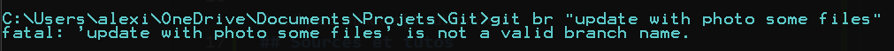
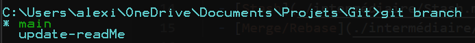
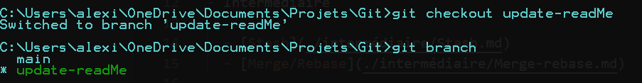

# Branches

Git intègre un système de branches, bien que ces branches d'ailleurs ne soient pas réelles et n'éxistent pas à proprement parler, 
ce système est plutôt pratique pour comprendre le fonctionnement et travailler avec GIT. 

## Branches d'arbre ? 

Il faut s'imager un peu git comme un arbre qui pousse dans le temps. 

Nous avons le tronc de l'arbre qui sera la branche principale et évidemment comme un arbre nous aurons différentes branches. 


Il peut être pertinent de créer des branches pour chaque sujet dans votre projet tel que la correction de bugs, la création de nouvelles feature, etc. 
En effet voyons un peu l'intérêt des branches. 

### Le but des branches

Prenons en exemple donc un projet. Nous allons avoir notre branche principale (notre tronc d'arbre), c'est donc notre axe qui contient notre code principale, fonctionnel
et potentiellement déployé. Nous ne souhaitons donc pas apporter des modifications entraînant des effets de bord ou encore des bugs.

C'est à ce moment que les branches et leur rôle entrent en jeux de façon efficace. 

Nous allons donc créer une branches pour chaque élément front ou back que nous voudrons mettre en place. 

## Création et déplacement 

Pour créer une branche rien de plus simple : 

```
git branche "nom-de-ma-branche"
```

On évite les espaces entre les mots, ici j'ai mis des "-" mais on peut bien mettre "_" ou d'autres caractères.



Evidemment pour se rappeler de chaque branches que nous avons créées on peut faire la commande suivante : 

```
git branch
```

Cela listera toutes les branches locales et marquera la branche sur laquelle nous sommes. 



Pour se déplacer d'une branche à une autre on peut alors faire la commande suivante : 
```
git checkout "nom-de-ma-branche"
```


Nous savons donc maintenant comment créer une branche, lister nos branches et se déplacer dessus. 

#### Note

Git ne vous laissera pas changer de branche si vous n'avez pas commit vos changements dessus ou bien [stash](../intermédiaire/Stash.md) ces derniers. 

## Suppression des branches

Une fois que votre travail sera terminé sur votre branche et que vous n'en aurez plus besoin soit parce que celle-ci est obsolète
soit parce que la branche a été merge avec votre branche main vous aurez surement besoin de la supprimer. 

Pour cela la commande est la suivante :

```
git branch -d "nom-de-ma-branche"
```

