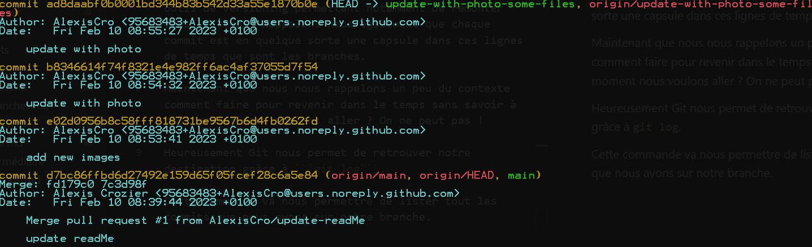

# Historique de commits

## Git log

Dans un article plus tôt nous avons dit qur Git est un outil de versioning permettant notamment de remonter dans le temps. Rappelons nous également que chaque commit est en quelque sorte une capsule dans ces lignes de temps que sont les branches. 

Maintenant que nous nous rappelons un peu du contexte comment faire pour revenir dans le temps sans savoir à quel moment nous voulons aller ? On ne peut pas ! 

Heureusement Git nous permet de retrouver notre destination grâce à ```git log```.

Cette commande va nous permettre de lister tout les commits que nous avons sur notre branche. 



Voici comment sont construits nos log : 
- identifiant du commit
- Auteur
- date du commit
- titre du commit

Pour sortir de l'interface des logs faites ```:q```

## Options

Comme nous pouvons le voir les log peuvent être assez long car riches en informations. 
Il existe donc des commandes d'options pour ```git log```.

En voici quelques unes : 

|   options         |   actions |
|   :------:        |   :-----: |
|   --merges        |  Liste seulement les commits de merge |
|   -n *integer*    | Permet d'afficher seulement les dernier log. Par exemple si vous mettez 2 vous aurez seulement les 2 derniers commits|
|  --oneline        |  Permet d'afficher les informations sur une seule ligne      |

Il y en a bien plus encore mais pour cela je vous invite à vous rendre sur [la documentation de git](https://git-scm.com/docs/git-log).
