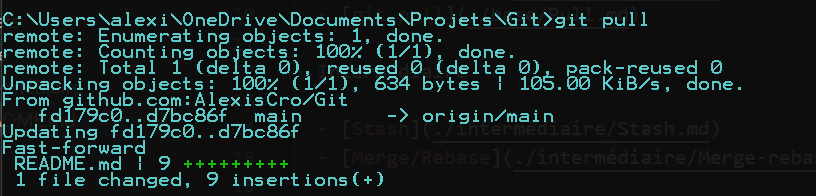

# Pull 

En travaillant avec des dépôts distants et surtout en équipe il se peut que la branche main ait été modifiée par un de vos collègues 
et qu'une de ces features ait été merge dans main. De ce fait votre branche main en local n'est donc plus à jour avec celle sur le serveur distant. 
Il vous faut donc récupérer le projet à jour. 

Pour cela on utilise la commande ```git pull```, cette commande est en réalité un alias regroupant deux commandes : 

```
git fetch
git merge
```

En effet, ```git pull``` réalise en premier lieu un ```git fetch``` qui va permettre de récupérer les commits sur la branche distante,
puis git fait un ```git merge``` pour fusionner les commits que nous venons de récupérer avec notre branche locale afin de la mettre à jour. 

Voici un aperçu de ce que cette commande peut générer :



Nous avons donc un message expliquant ce que Git a fait lors de cette commande. 

Ici Git détecte un fichier modifié et différent de notre dépôt local, il dit à quel dépôt distant il se réfère et nous avons donc le fichier modifié ( ici avec 9 ajouts ).