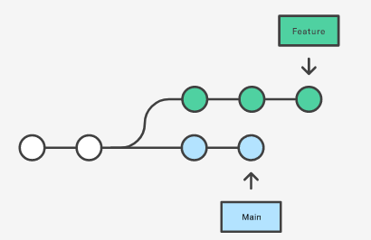
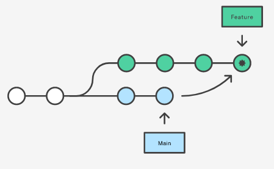
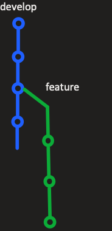
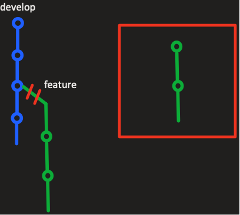

# Merge/Rebase ? 

Dans git il y a 2 solutions pour rapporter notre branche de travaille à la branche principale : 

- Merge 
  
- Rebase
	
Les deux commandes arrivent à peu près au même résultat, c'est à dire une mise à jour de la branche souhaitée,  mais le fonctionnement et la finalité diffèrent un peu. 

Pour commencer prenons l'exemple d'une branche principale nommée main. De cette branche nous allons travailler sur une nouvelle feature donc nous allons créer une nouvelle branche. 
Cependant dans le contexte d'un travail en équipe il est possible que la branche main évolue également. 
Nous aurions alors un historique de commit dit forké comme ceci : 



Enfin supposons que certaines fonctionnalités dans les commits de main nous sont utiles dans notre branche feature nous aurons donc besoin de les récupérer. C'est à ce moment qu'interviens alors notre merge ou notre rebase. 

# Merge :
La solution la plus simple est d'utiliser un git merge. 
2 possibilités pour merger des commits de main dans feature : 

```
Git checkout feature
Git merge main
```

Ici on se place dans la branche cible puis on merge les commits venant de la branche source. 
		
```
Git merge feature main
```

Ou ici nous faisons la même chose mais en une commande. 
		
## Que fait merge ?
Avec ces actions nous allons donc avoir un commit de merge agissant pour fusionner les données de nos branches. 
	

	
L'avantage est que les branches ne sont pas altérées (dans ce cas la branche main).
Cependant si une branche main est particulièrement active alors il y aura un certains nombre de commit de merge pouvant polluer notre branche feature

# Rebase :
La seconde solution est donc le rebase. 

## Principe :
Il est important de comprendre le fonctionnement du rebase, premièrement pour savoir réellement ce qu'il fait et deuxièmement 
pour savoir comment l'appliquer.

Prenons un cas simple, nous avons une branche principale que nous appellerons "develop" puis notre branch sur laquelle nous effectuons des modifications
que nous nommerons feature.
Voici donc un exemple de ce que cela pourrait être :



Pour commencer soulignons que la branche feature part d'un commit de la branche develop, ce qui est normal,
c'est ce qu'on appelle un commit parent.
Nous voyons que develop a un commit qui a été rajouté après le début de notre travail sur feature
mais nous avons besoin du changement pour que notre branche feature fonctionne correctement 
ou tout simplement pour vérifier que notre code fonctionne avec les changements apportés sur develop. 

Nous allons donc devoir rebase notre branche feature pour changer notre commit parent.

## Que fait le rebase ?

Dans un premier temps le rebase va couper le lien avec la branch develop et stocker, de manière temporaire, 
feature dans une boîte à part.



Puis git va comparer les commits et vérifier si il y a des conflits à résoudre ou non. Si il y a conflit, 
il demandera une résolution (pour résoudre facilement vos conflits je vous invite à utiliser
[Github desktop](https://desktop.github.com/)). 

Une fois les conflits résolus, si il y a besoin, git va donc rebase notre branche sur le dernier commit de develop. 
Le commit parent va donc changer. 


## Commandes
Il faut donc se placer sur notre branche cible (ici feature).

Puis nous allons rebase avec develop.
```
Git checkout feature
Git rebase develop 
```

## Les avantages de Rebase
L'avantage est d'avoir un historique bien plus propre qu'avec des merge qui génèrent des commit de merge. 
De plus l'historique est linéaire. 
En revanche si on ne suit pas la règle d'or du rebase, le rebase peut vite devenir dangereux et réécrire tout le projet, ce qui peut poser de sérieux problème dans un projet en collaboration. 
	 
## Règle d'or du Rebase :

Celle-ci est plutôt simple il ne faut jamais rebase une branche public, il ne faut donc jamais rebase develop sur une autre branche. Car dans ce cas nos commit créés sur develop après la création de notre branche locale seront rebaser sur notre branche feature. 


### Source des images

https://www.atlassian.com/fr/git/tutorials/merging-vs-rebasing
